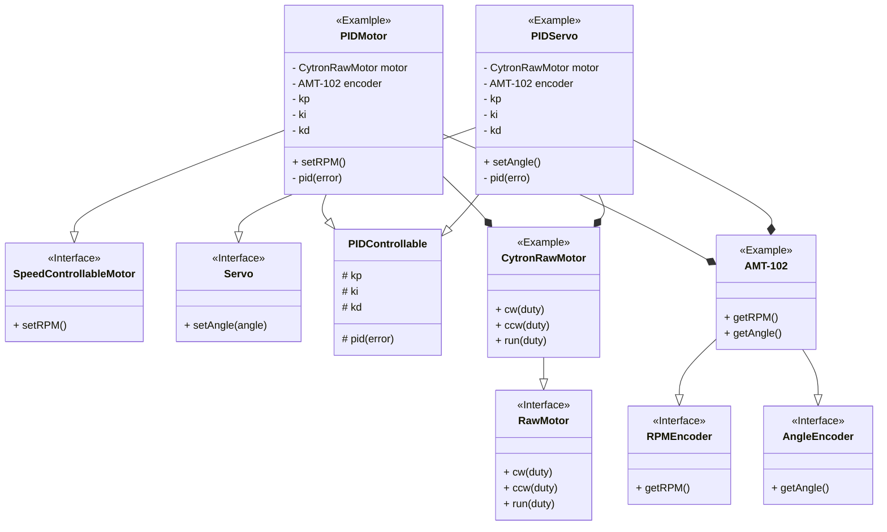

# Interface design

## Diagram

## Interface explain

### RawMotor

Duty比で制御するモータ。速度等は一切保証しない。

### SpeedControllableMotor

速度制御可能なモータ。

### Servo

角度制御可能なモータ(サーボモータ)。

### RPMEncoder

角速度(RPM)読取が可能なエンコーダ。

### AngleEncoder

角度読取が可能なエンコーダ。
